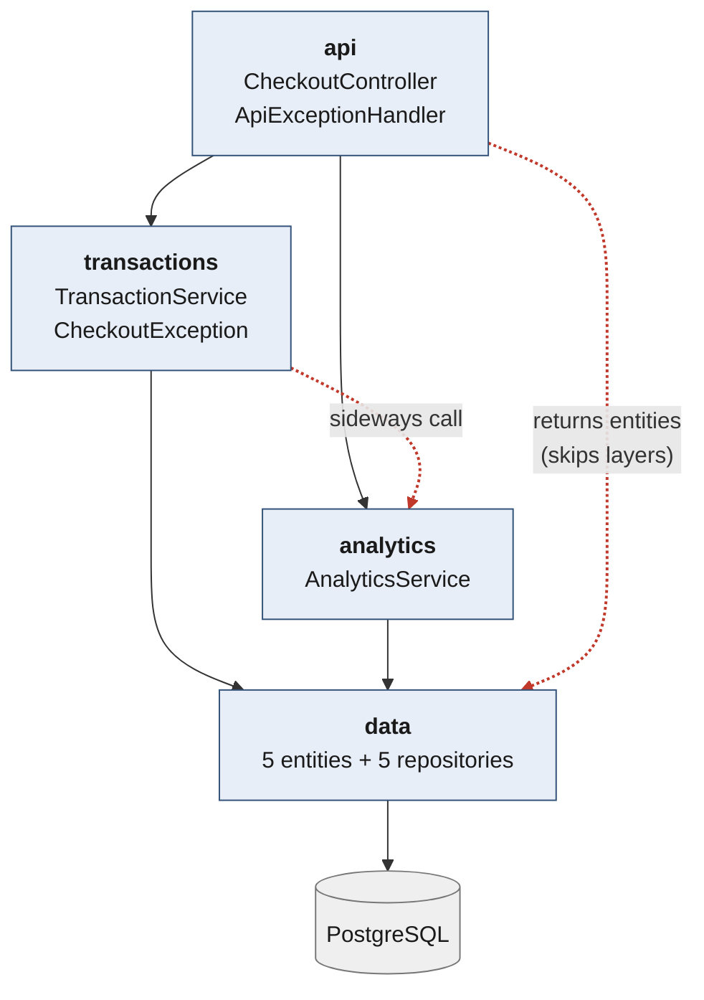

# Week 2 — Layered Architecture

Same API contract, stack and seed data as Week 1. Only the internal structure changed.

## Layers



Solid arrows are canonical downward dependencies. **Dashed red arrows are the two
deviations** — both deliberate, both explained below.

Enforced as a build failure by `LayeringRulesTest` (ArchUnit, 4 rules), verified
non-vacuous by planting a repository reference in the controller.

| Layer | Responsibility |
|---|---|
| `api` | HTTP only — routing, validation, error translation. No business logic. |
| `transactions` | Basket lifecycle: start, scan, complete. Catalog reads. |
| `analytics` | Scan ingestion, popular-items window, low-stock alerts. |
| `data` | Entities and Spring Data repositories. |

## Differences from the canonical style

Reference: Richards & Ford, *Fundamentals of Software Architecture*, Ch. 10 — four
**closed**, **technically partitioned** layers (Presentation → Business → Persistence →
Database).

**1. `api` reaches `data` directly.** Controllers return JPA entities rather than DTOs.
Richards' layers are closed so that a change in one cannot ripple into others — *layers of
isolation*. Returning entities forfeits that: a column rename becomes a breaking API change.
In the book's terms the data layer is effectively **open**.

*(DTOs are Fowler / enterprise-Java convention, not a Richards prescription. The textbook
violation is the layer skip, not the missing DTOs.)* Traded for size: an earlier draft with
DTOs, domain records and service interfaces was 58 files. This is 16.

**2. `transactions` calls `analytics` sideways.** Layers call down, never across. The
orthodox alternative — `ApplicationEventPublisher` — would also have set up the
event-driven week and made async analytics a one-annotation change.

**3. The middle is domain-partitioned, not technical.** `api` and `data` are technical
layers, but `transactions` and `analytics` are *domain* slices. Canonical layered is purely
technical. This hybrid gives better change locality (popular-items lives in one file) at the
cost of the clean technical story — and it is why Week 3's service extraction will be easy.

**4. Minor:** Persistence and Database are merged into `data`; services are concrete classes
rather than interfaces; `find()` and `listCatalog()` are pass-throughs (a mild
*architecture sinkhole*, but well inside the book's 80/20 tolerance).

## Performance and correctness

Phase 1 was strictly behaviour-preserving, so the load test isolated the cost of layering:
**364.1 tx/s vs the monolith's 368.34** — inside noise. The layering itself bought no
performance. What it bought was that each optimisation below became a single-file change.

| change | effect |
|---|---|
| Index on `transaction_line_items(transaction_id)` | +20% tx/sec; COMPLETE p50 14.83 → 5.61 ms; `seq_tup_read` 2.5 B → 0 |
| `complete()` in one `@Transactional` | ~12 auto-commits → 1; finally atomic |
| Units that cannot be decremented are not sold | stock invariant passes |
| Receipt from one `findAllById` | removes an N+1 over distinct SKUs |
| HikariCP left at 10 | measured, not defaulted |

Decrements are issued **last** and in **sorted SKU order** — locks are now held to commit,
so a long window on a hot SKU costs more than batching saves, and multiple row locks in one
transaction deadlock without a global ordering.

Raising the pool 10 → 24 (the `(cores × 2) + 1` heuristic) left throughput flat at 100
stations (484.7 → 483.3) while p99 went 41 → 147 ms. The constraint is downstream of the
pool; extra connections just move the queue into PostgreSQL.

**Out of stock:** the contract defines no out-of-stock error and scans are explicitly not
gated on stock. Units that cannot be decremented are removed from the transaction rather
than sold, so the receipt reflects what was dispensed and the ledger balances — stock stays
non-negative *and* the invariant holds, without inventing a status code.

Results in `quality-attribute-analysis/`.

## Run it

```bash
createdb selfcheckout      # once; shared with monolith/, cannot run concurrently
./mvnw spring-boot:run     # :8080, ddl-auto=create reseeds 2000 SKUs each boot
./mvnw test                # includes the ArchUnit layering rules
```