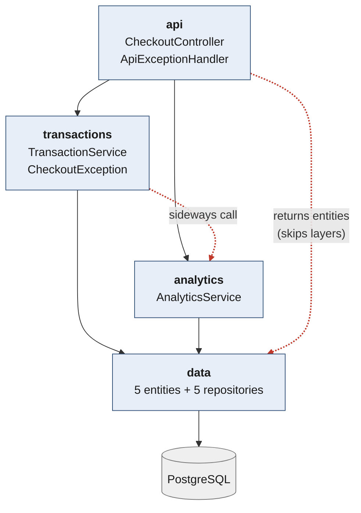

# Week 2 — Layered Architecture

Same API contract, stack and seed data as Week 1.

## Layers



Solid arrows are canonical downward dependencies. **Dashed red arrows are the two
deviations** — both deliberate, both explained below.

Enforced as a build failure by `LayeringRulesTest` (ArchUnit, 4 rules), verified
non-vacuous by planting a repository reference in the controller.

| Layer | Responsibility |
|---|---|
| `api` | HTTP only — routing, validation, error translation. No business logic. |
| `transactions` | Basket lifecycle: start, scan, complete. Catalog reads. |
| `analytics` | Scan ingestion, popular-items window, low-stock alerts. |
| `data` | Entities and Spring Data repositories. |


## Key Performance Improvement

| change | effect |
|---|---|
| Index on `transaction_line_items(transaction_id)` | +20% tx/sec; COMPLETE p50 14.83 → 5.61 ms;  |
| `complete()` in one `@Transactional` | ~12 auto-commits → 1; finally atomic |

Results in `quality-attribute-analysis/`.

## Run it

```bash
createdb selfcheckout      # once; shared with monolith/, cannot run concurrently
./mvnw spring-boot:run     # :8080, ddl-auto=create reseeds 2000 SKUs each boot
./mvnw test                # includes the ArchUnit layering rules
```