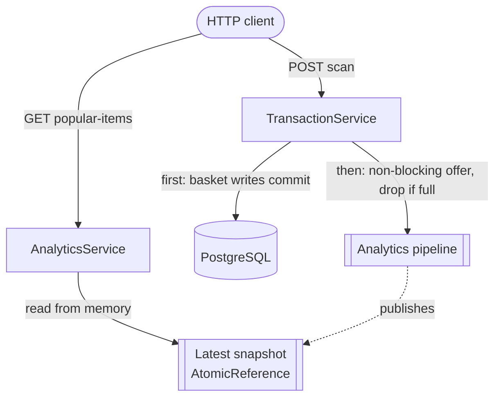
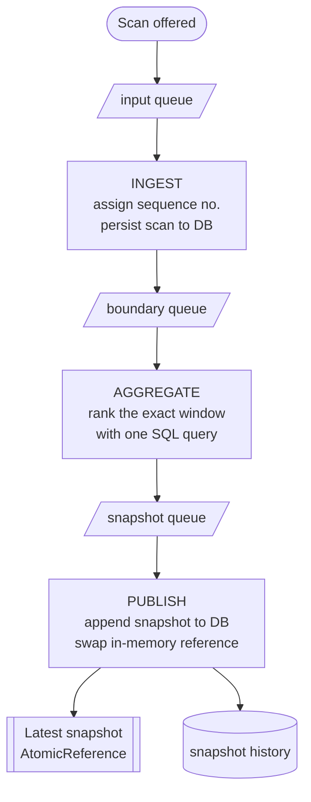

# Self-checkout System: Pipeline Architecture

A separate Maven app initialized from `../layered/`. Catalog, basket lifecycle, checkout, and low-stock stay layered and unchanged. **Only popular-item analytics** is refactored into filters connected by pipes.

---

## 1. Architecture: analytics is decoupled from checkout

A scan commits its basket writes first, then hands the sample to the analytics pipeline **non-blocking** (dropped if the pipe is momentarily full). `GET /analytics/popular-items` reads a snapshot straight from memory. So analytics backpressure can **never block or fail a checkout**.

---

## 2. 3-stage Pipeline for Analytics

The analytics system has a 3-stage pipeline:

**ingest** (sequences and persists scans) → **aggregate** (ranks the exact hopping window with SQL) → **publish** (appends the snapshot and swaps the in-memory latest-snapshot reference)

The filters run on three Java worker threads connected by bounded blocking queues (`ArrayBlockingQueue`). Scans are offered non-blocking after the basket writes commit, and GET reads the snapshot from memory, so analytics never blocks or fails a checkout. Checkout and low-stock remain layered.

**ingest → aggregate → publish**, each on its own worker thread, connected by bounded Java `ArrayBlockingQueue`s (the pipes).

| Stage | Purpose                                                                                                                                                                   |
| --- |---------------------------------------------------------------------------------------------------------------------------------------------------------------------------|
| **Ingest** | Assigns a monotonic sequence number in FIFO order and saves each scan to `scan_events`. Emits a window boundary every 500 scans (once 1000 have accumulated).             |
| **Aggregate** | Runs one SQL query over the exact interval `[end-999, end]`, joins catalog names, ranks every SKU by count desc then SKU asc.                                             |
| **Publish** | Appends the ranked snapshot in one transaction (removed delete previous snapshot logic from layered architecture) and swaps it into the `AtomicReference` that GET reads. |

Windows at defaults are `[1,1000]`, `[501,1500]`, … The requested `limit` is applied to the full ranking at response time. Queued inputs are volatile (lost on abrupt crash); startup recreates the database.

---
## 3. Performance analysis

Stress mode (`--stations=100 --duration=120`), seed 10,000/SKU matched to baseline, pool of 10, zero HTTP errors. Reports in `quality-attribute-analysis/`.

| Over the same 120s run | Baseline (layered) | Pipeline | Δ |
| --- | --- | --- | --- |
| Total transactions | 60,383 | **76,001** | **+26%** |
| Total items scanned | 635,016 | **800,293** | **+26%** |

**The key change: the snapshot rebuild left the request thread.**

In the layered version, every 500 scans a scan request ran the snapshot step **inline**: it deleted the whole previous snapshot and rebuilt it (`deleteAllInBatch` → re-query → re-insert) on the hot path. Whichever customer's scan landed on that boundary had to wait for the full delete-and-rewrite before getting a response.

The pipeline removes that from the request path:

- **Off the hot path** — all snapshot work now runs on the background **publish** worker, so no scan request ever waits for it.
- **No delete** — snapshots are append-only, so the old wipe-and-rebuild step is removed to reduce database round trips.

Over the same 120s, that frees the request threads to handle **~26% more transactions**.

---

