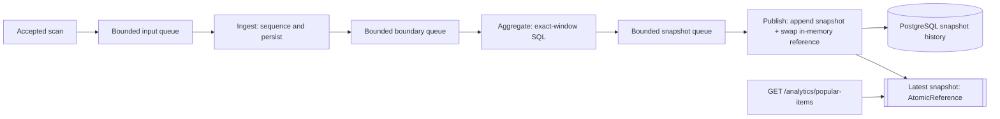

# Database Analytics Pipeline

A separate Maven application initialized from `../layered/`. The original layered application, shared OpenAPI contract, and load client are unchanged. Catalog, basket lifecycle, checkout, and low-stock stay layered. Only popular-item analytics is refactored into filters connected by pipes.

## Phases

| Phase | Implementation | Status |
| --- | --- | --- |
| 0: baseline | Original layered Java sources, same 10,000-stock seed | Rebuild with Maven `baseline` profile |
| 1: database pipeline | Ordered scan persistence -> exact-window SQL aggregation -> append-only snapshot persistence | Implemented; load runs captured (see **Measured results**) |
| 2: optional optimization | Consider batching, metadata caching, or narrower transaction scope individually | Deferred until measurements justify it |
| 3: in-memory comparison | Replace analytics storage/computation with worker-owned window state only if results justify it | Deferred |

## Build and run

Requires JDK 21+ and the existing PostgreSQL `selfcheckout` database. Both modes use that database, recreate tables, and seed 2000 SKUs with 10,000 stock each on startup. Run one server at a time. The connection pool remains ten.

From `pipeline/`, build/run the original Java logic with the matched seed:

```bash
./mvnw -Pbaseline package
java -jar target/baseline/pipeline-baseline.jar
```

The baseline profile compiles `../layered/src/main/java` directly; it does not copy the refactored pipeline classes. Its tests also use the original layered test sources with isolated H2 test configuration. Output is separate from the default build.

Stop that server, then build/run the database pipeline:

```bash
./mvnw package
java -jar target/pipeline-0.0.1-SNAPSHOT.jar
```

`./mvnw test` uses an isolated in-memory H2 database; it does not recreate the production PostgreSQL tables. H2 checks are not PostgreSQL performance measurements.

## Filters and pipes



The analytics system is a **3-stage pipeline**:

**ingest** (sequences and persists each scan) → **aggregate** (ranks the exact window with SQL) → **publish** (appends the snapshot and swaps the in-memory reference)

The pipes are three bounded Java `ArrayBlockingQueue`s, one between each pair of stages; each stage runs on its own worker thread.

- **Ingest** assigns a monotonic sequence number in FIFO order, saves each raw scan to `scan_events`, and emits a window boundary after the insert commits (at defaults, every 500 scans once 1000 have accumulated).
- **Aggregate** runs one SQL query over the exact inclusive sequence interval `[end - 999, end]`, joins catalog names, and ranks every SKU by count descending then SKU ascending.
- **Publish** appends every ranked row of one snapshot in a single transaction (history is never deleted), then swaps the completed snapshot into an `AtomicReference`.

At defaults, windows are `[1,1000]`, `[501,1500]`, and so on. There is no partial-window publication before 1000 scans. The requested `limit` is applied to the complete ranking at response time rather than truncating stored history.

### Request path is decoupled (best-effort, non-blocking)

`TransactionService.scan()` performs its basket writes first, then calls `AnalyticsService.recordScan()`, which does a **non-blocking** offer onto the input queue. If the queue is momentarily saturated (or the pipeline is draining), the sample is **dropped** rather than blocking or failing the checkout. Analytics backpressure can never turn a committed basket write into an error. Dropping a sample before ingest is safe for correctness: sequence numbers are assigned only to scans the ingest worker actually receives, so persisted windows stay contiguous and complete.

`GET /analytics/popular-items` reads the latest published snapshot directly from the in-memory `AtomicReference` — no queue, no reservation, no barrier — so the query is O(1) and cannot be blocked or failed by a saturated input queue. (An ordered query-barrier path, `AnalyticsPipeline.snapshot()`, is retained for the pipeline lifecycle tests but is not on the request path.)

Worker failures fail pending barrier waits and stop new admission; orderly shutdown stops admission and drains accepted inputs before closing database resources. Queued inputs are volatile and may be lost on abrupt process failure; startup recreates the database, so durable recovery/outbox delivery is outside this phase.

Checkout still commits inventory, fulfillment, and completion together. No stock batching or catalog cache is introduced. Same-basket concurrent-mutation limitations are preserved.

## Measured results

All runs: JDK 21, PostgreSQL, Hikari pool of 10, seed 10,000 units/SKU (matched to the baseline), app + database + load client on one machine, zero HTTP errors on every operation. Baseline figures are the layered application (`../layered/`) under the same seed and client.

**Stress mode** — `--stations=100 --duration=120`:

| Metric | Baseline (layered) | Pipeline | Δ |
| --- | --- | --- | --- |
| Transactions/sec | 502.2 | 632.7 | **+26.0%** |
| Items/sec | 5,281 | 6,663 | +26.2% |
| SCAN p99 (ms) | 42.2 | 27.4 | −35% |
| COMPLETE p99 (ms) | 45.0 | 32.5 | −28% |
| START p99 (ms) | 42.4 | 26.9 | −37% |

**Default parameters** — 10 stations / 60s: 536.9 → 559.1 tx/sec (+4.1%); gains are small here because at 10 stations the pool of 10 is not saturated.

Report JSON for the two assignment runs lives under `quality-attribute-analysis/` (default and stress). These are actual client outputs, not fabricated or copied from historical reports.

### Where the improvement comes from

The gain is **architectural**, and it works by removing synchronous database round-trips from the request path:

1. **One fewer DB round-trip per scan.** In the baseline, `recordScan()` ran inline on the request thread, so each scan did **5** round-trips: find-transaction, find-item, insert line-item, update transaction, **insert scan_event**. The pipeline offloads the `scan_event` insert to the background ingest worker, so the request path does **4** (the analytics hand-off is an in-memory queue offer with no DB work). That ~20% cut in hot-path round-trips tracks the ~26% throughput gain closely.
2. **The periodic recompute spike is gone from the hot path.** The baseline ran a full recompute (ranking query + snapshot `delete` + inserts) inline on whichever request hit each 500-scan boundary. That now runs on the aggregate/publish workers, which is the main reason p99 and max dropped sharply.
3. **GET does no DB work.** The baseline ran a `findLatestSnapshot` query per request; the pipeline reads the in-memory reference.
4. **The pool of 10 is the real bottleneck.** Shorter per-request connection holds free the pool, so even `START_TRANSACTION` — which touches neither analytics nor stock — sped up ~37% at p99. That is the signal that the win is request-path relief, not a seed artifact.

The improvement was **confirmed against the stock-seed confound**: running the pipeline at 10,000 stock (so the hot SKUs exhaust exactly as in the baseline, and `complete()` does the same unfulfilled-unit `deleteAllInBatch` work) still produced +26%, so the gain is not an artifact of carrying more stock.

### Notes and known debt

- The delete→append snapshot change is a *history-retention* decision, not a performance one: it writes more rows per window (full ranking, unbounded until restart) and only avoids the hold-up because snapshot writes moved off the request thread. The latency win comes from the off-thread move, not from append-vs-delete.
- After the GET path moved to the in-memory reference, `PopularItemSnapshotRepository.findLatestSnapshot()` is now **dead code** and the `popular_items_snapshot` table is write-only history. Both would be removed in the deferred in-memory phase (Phase 3), which eliminates analytics SQL entirely.
- A single serial ingest worker is the next potential bottleneck; queueing alone is not a performance guarantee.

## Reproduce the measurements

In `load-client/`, build the unchanged client once, then run default and stress separately, restarting the server between runs for fresh stock:

```bash
./build.sh
java -cp out Main                            # default parameters
java -cp out Main --stations=100 --duration=120   # stress mode
```

Timestamped JSON lands in `load-client/reports/`. Record command, JDK/PostgreSQL version, pool, stock, and configuration with the results. Compare transaction/item throughput and SCAN/COMPLETE p95/p99. The client catches analytics-fetch errors and can write an empty popular-items list, so inspect console warnings.

Optional database validation after a pipeline run:

```bash
psql -d selfcheckout -f quality-attribute-analysis/validate.sql
```

Verify contiguous scan sequences, exact counts/ranks/boundaries, retained history, and remaining stock.

## Submission description

The analytics system has a 3-stage pipeline:

**ingest** (sequences and persists scans) → **aggregate** (ranks the exact hopping window with SQL) → **publish** (appends the ranked snapshot and swaps the in-memory latest-snapshot reference)

The filters run on three Java worker threads connected by bounded blocking queues (`ArrayBlockingQueue`). Scans are handed to the pipeline non-blocking and best-effort after the basket writes commit, and `GET /analytics/popular-items` reads the published snapshot from memory, so analytics never blocks or fails a checkout. Checkout and low-stock remain layered.

Repository: https://github.com/lingeorge88/CS6510-2026. The two pipeline JSON reports (default and stress) are in `quality-attribute-analysis/`.

## Verification

Both Maven package builds pass: the database pipeline runs 16 tests and the original-source baseline profile runs its layered tests. Tests use isolated H2 and cover append-history, exact ranking, rollback, the query barrier, admission, worker failure, and graceful drain.
