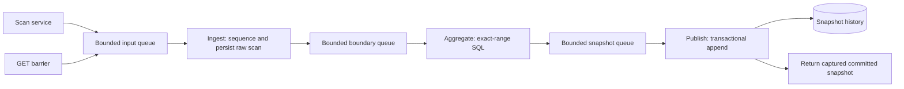

# Implementation Plan: Database Analytics Pipeline

**Date**: 2026-10-02  
**Selected design**: Database-first pipeline; in-memory transition deferred  
**Spec**: [spec.md](spec.md)  
**Research**: [research.md](research.md)  
**Additional review**: [backend-optimization-review.md](backend-optimization-review.md)  
**Tasks**: [tasks.md](tasks.md)

> **Revision (2026-10-02):** After load testing, the "Admission, sequencing, and GET" design below was reverted. Scans are handed off **non-blocking and best-effort after basket writes** (dropped on saturation, never blocking/failing checkout), and GET reads the in-memory `AtomicReference` directly instead of enqueuing a query barrier. The reserve-before-write semaphore and barrier remain only in the lifecycle tests. The seed is 10,000 (matched to baseline), not 100,000. See the spec revision and `pipeline/README.md` for the shipped behavior and measured results (+26% stress throughput). The sections below are retained as planning history.

## Phase 0: Initialize and preserve a reproducible baseline

Initialize a standalone `pipeline/` Maven project from layered build/source. Keep Java 21, Spring Boot 4.1.1, PostgreSQL, the pool of ten, existing routes, and architecture rules. Raise only the new project's seed to 100,000 units per SKU. Production uses existing `selfcheckout` and recreates tables on startup, as requested.

The Maven `baseline` profile compiles `../layered/src/main/java` and original test sources, with shared pipeline resources and separate output `target/baseline/pipeline-baseline.jar`. Thus original Java behavior remains reproducible after implementation, with matched stock. Tests activate isolated H2. Do not modify original layered source or initialize a nested Git repository.

The user canceled baseline capture and owns all load runs. Build verification is allowed; no load reports or performance conclusions are generated by this phase.

## Phase 1: Three database filters

| Filter | Purpose | Output |
| --- | --- | --- |
| Ingest | Assign FIFO sequence; save each raw scan and wait for repository commit | Eligible full-window boundary |
| Aggregate | Count exact sequence range, join catalog names, rank count descending/SKU ascending | Immutable full-ranking frame |
| Publish | Append all rows in one transaction, then publish committed result | Retained database generation and query barrier result |

Each filter runs on one worker thread. Bounded `ArrayBlockingQueue`s connect them. Ingest forwards only hop boundaries, barriers, and end-of-stream; it does not forward every scan to SQL aggregation. No in-memory rolling count algorithm is used in this phase.

Defaults: input capacity 2048, boundary and snapshot capacities 16 each, admission/query timeout five seconds, shutdown timeout thirty seconds. These are starting settings, not measured optimum values.

## Admission, sequencing, and GET

The scan service reserves input capacity after request validation and before basket writes. A semaphore bounds queued inputs plus outstanding reservations. Successful writes are followed by reserved enqueue; failure closes/releases an unsubmitted reservation. Keep current separate repository write commits. A successful scan means input accepted; persistence continues asynchronously.

Ingest is the only sequence owner. It saves the event before exposing a boundary, so every scan in that boundary's interval is committed. Aggregate SQL uses inclusive bounds rather than newest-row LIMIT. Newer inserts cannot contaminate the frame.

GET enqueues a barrier behind accepted scans. Every stage forwards it after earlier work, even if no hop was emitted. Publisher completes its future with the snapshot at that position after all earlier snapshot transactions committed. Return that captured value. The first eligible window ends at 1000; subsequent ends are multiples of 500. Before warmup, return zero boundaries, empty items, and a valid timestamp.

Use one Spring-managed transactional snapshot writer or `TransactionTemplate`. Commit all ranks together and never delete old generations. After commit, cache the immutable full result for barrier responses; the cache is an optimization over persisted output, not a replacement for database windowing. Add latest-window/rank indexing and rank ordering.

## Failure and lifecycle

Supervise workers. Failure stops new admission and completes pending barriers exceptionally. Waiting operations check health and deadlines; do not silently drop scans. On shutdown, stop new admission, settle outstanding reservations, enqueue end-of-stream behind accepted inputs, propagate it after preceding messages, and join workers before closing the data source. Queue emptiness is not a drain guarantee.

Retained raw rows and snapshots are durable after commit; queued inputs remain volatile. Startup recreation still wipes history. Outbox/recovery is a separate design if stronger guarantees are needed.

## Phase 2: User-run measurements

Build/run commands and report locations are in [pipeline README](../../pipeline/README.md). The user runs baseline and pipeline default/stress tests, on fresh startup seeds, one server at a time. No load-client runs are executed automatically.

Compare throughput and SCAN/COMPLETE p95/p99, inspect analytics-fetch warnings, validate complete endpoint metadata and retained database history, and check final stock. The unchanged client reports ranking but not window metadata. Read-only SQL validation belongs in `pipeline/quality-attribute-analysis/validate.sql`.

Measure snapshot rows written too: full ranking means potentially hundreds of inserts per window versus the previous ten. A serial ingest worker can bottleneck on per-scan commits. Queueing alone is not evidence of improved throughput.

## Later phases: Changes gated by evidence

1. If ingest commits dominate, evaluate deliberate JDBC microbatching while preserving contiguous sequence ranges and barrier order. `IDENTITY` plus `saveAll()` is not automatic Hibernate batching.
2. If ranking/publication dominates, evaluate snapshot persistence volume, retention, and read paths.
3. If catalog/checkout SQL dominates, separately evaluate immutable metadata caching, quantity decrements, or a short atomic scan writer.
4. Shorten completion preparation/mapping while preserving one commit only if measured lock duration warrants it.
5. Compare in-memory analytics only after the user has measured the database pipeline. That alternative would replace raw-scan SQL/window queries/snapshot writes with worker-owned deque/count state and atomic publication; it is not implemented in this phase.

Preserve sorted inventory lock order, monetary precision, fixed catalog ordering for matched comparisons, and current HTTP behavior. Same-basket locking/version hardening is separate. No cache, stock batching, schema aggregation, or transaction splitting is introduced now.

## Verification and submission

Use targeted isolated tests for exact bounds, ties/full ranks, append history, commit rollback, concurrent sequencing, reservations, barriers, failure and shutdown. Preserve four ArchUnit rules. Build both default and baseline Maven profiles.

When the user supplies genuine client outputs, retain baseline reports separately and place the two assignment pipeline JSON files under `pipeline/quality-attribute-analysis/`. Update README with results; do not claim submission artifacts exist before those runs. Proposed repository URL remains `https://github.com/lingeorge88/CS6510-2026`.
